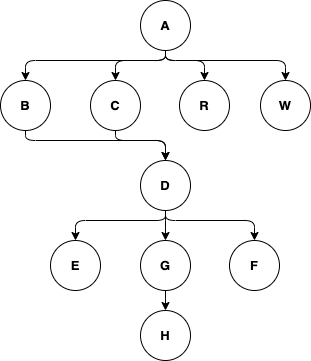

# Accordion 🪗

## 项目介绍

`手风琴` 是一个自动化任务框架，你可以将多个动作组合起来实现高效的自动化任务，就像 `IFTTT` 简单且直接，快速提升你的系统效率。


## 快速开始

创建你自己的项目，使用 `Maven` 或 `Gradle` 引入手风琴框架。

> 最新的版本请查阅 GitHub Release 或搜索 Maven repository。

#### Maven

```xml
<dependency>
    <groupId>chat.octet</groupId>
    <artifactId>accordion</artifactId>
    <version>LAST_RELEASE_VERSION</version>
</dependency>
```

#### Gradle
```txt
implementation group: 'chat.octet', name: 'accordion', version: 'LAST_RELEASE_VERSION'
```

#### Hello world

创建一个动作的配置模版，这里我们使用 `自定义脚本` 输出 `Hello world`。

```java
ActionConfig myAction = ActionConfig.builder()
        .id(CommonUtils.randomString("ACT").toUpperCase())
        .actionType(ActionType.SCRIPT.name())
        .actionName("My action")
        .actionDesc("My first action example")
        .actionParams(ScriptParameter.builder().script("println('Hello world')").build())
        .build();
```

创建手风琴的琴谱 `AccordionPlan`，琴谱是一段完整的执行计划，包含每一步的执行动作。然后创建一个手风琴 `Accordion` 来播放这个琴谱。

```java
AccordionPlan plan = AccordionPlan.of().start(myAction);
Accordion accordion = new Accordion(plan);
accordion.play(true);
System.out.println("Accordion plan:\n" + accordion.verbose());
```

执行完成的输出如下，使用 `verbose` 方法可以打印执行链路和每个动作的执行状态。

```log
Hello world
... ...

Accordion plan:
🅞───⨀ ✅ My action (ACT-DEM9W7UDPC)
```

## 功能介绍

以下是对本项目主要功能的介绍，你可以根据需要选择性阅读，这将帮助你快速了解手风琴框架的技术特点和使用方法。

### AccordionPlan

琴谱 `AccordionPlan` 是一个执行计划 (DAG)，由 `执行链` 和 `动作` 组成。执行计划由一个起始动作开始，然后通过 `next` 方法连接其他动作，形成一条执行链。

> ℹ️ **TIPS**
> 
> - 执行链连接每一个动作，在DAG中它是边 `Edges`，而动作则是具体的每个节点 `Nodes`。
> 
> - 每一个动作的执行都依赖于前序动作，如果前序动作执行失败，那么后序动作将不会执行。

`AccordionPlan` 的主要方法：

```java
/**
 * Add a start action.
 *
 * @param actionConfig Action config
 * @return AccordionPlan
 */
public AccordionPlan start(ActionConfig actionConfig);

/**
 * Add a next action.
 *
 * @param previousAction Previous action
 * @param nextAction     Next action
 * @return AccordionPlan
 */
public AccordionPlan next(ActionConfig previousAction, ActionConfig nextAction);

/**
 * Add one or more next actions.
 *
 * @param previousAction Previous action
 * @param nextActions    One or more next actions
 * @return AccordionPlan
 */
public AccordionPlan next(ActionConfig previousAction, ActionConfig... nextActions);

/**
 * Reset the plan status.
 */
public void reset();

/**
 * Export the plan to JSON.
 *
 * @return String
 */
public String exportToJsonConfig();

/**
 * Import the plan from JSON.
 *
 * @param accordionConfigJson Accordion config JSON.
 * @return AccordionPlan
 */
public AccordionPlan importConfig(String accordionConfigJson);

/**
 * Import the plan from AccordionConfig.
 *
 * @param accordionConfig Accordion config.
 * @return AccordionPlan
 */
public AccordionPlan importConfig(AccordionConfig accordionConfig);

```

**示例**

这里使用一个复杂的执行计划进行演示，如下图所示，一共包含了 10 个动作，每个动作都通过 `next` 方法连接起来。



执行计划示例：

```java
// ... ...
AccordionPlan plan = AccordionPlan.of()
        .next(a, b, c, r, w)
        .next(b, d)
        .next(c, d)
        .next(d, e, g, f)
        .next(e, h)
        .next(f, h)
        .next(g, h);

Accordion accordion = new Accordion(plan);
accordion.play(true);
System.out.println("Accordion plan:\n" + accordion.verbose());
```

执行计划的输出：

```text
Accordion plan:
🅞───⨀ ✅ A (ACT-M43B62QK56)
	├───⨀ ✅ B (ACT-HBT8E98ZJP)
	├───⨀ ✅ C (ACT-7239Z51LKX)
	├───⨀ ✅ R (ACT-5VR1Y3WMBP)
	└───⨀ ✅ W (ACT-T39P7JFIVL)
		└───⨀ ✅ D (ACT-XUM24TLIBI)
			├───⨀ ✅ E (ACT-0KSSQYF52E)
			├───⨀ ✅ G (ACT-XU3OXGBZ5Y)
			└───⨀ ✅ F (ACT-56Q2VNG5B4)
				└───⨀ ✅ H (ACT-LERLLYDHQN)
```

**导入导出执行计划**

当创建了执行计划后，你可以将其导出为 `JSON`，以便于持久化存储，或者将其导入到另一个执行计划中。

```json
{
  "id": "ACR-MDESSISDQB",
  "name": "Default accordion name",
  "desc": "Default accordion desc",
  "graph_config": {
    "actions": [
      {
        "id": "ACT-BKFR133GZ0",
        "action_type": "SCRIPT",
        "action_name": "My action",
        "action_desc": "My first action example",
        "action_params": {
          "scriptId": "script-dyk9obhc63",
          "script": "1+1",
          "debug": false
        },
        "action_output": [
          {
            "name": "number",
            "datatype": "LONG",
            "desc": "Calc result"
          }
        ]
      },
      {
        "id": "ACT-OLH1M13ZIR",
        "action_type": "CONDITION",
        "action_name": "Condition action",
        "action_desc": "Condition action example",
        "action_params": {
          "expression": "(number == 2)",
          "debug": false
        }
      }
    ],
    "edges": [
      {
        "previous_action": "ACT-BKFR133GZ0",
        "next_action": "ACT-OLH1M13ZIR"
      }
    ]
  },
  "updatetime": "2024-01-09 12:51:43"
}
```

### 动作

动作是一个执行单元，可以做很多事情。每个动作都拥有 `输入`，`执行`，`输出` 三个阶段。

- **输入**
  - 动作的输入参数可以是上一个动作的输出结果，也可以是事件消息。在开发中我们不需要进行声明，`AbstractAction` 会自动处理。

- **执行**
  - 动作的执行逻辑，具体可以查阅预置动作的代码。

- **输出**
  - 动作的输出参数，需要在动作的配置模版中 `actionOutput` 进行指定。

- **状态**
  - ⚪️ `NORMAL`  默认状态
  - 🅾️ `ERROR`   执行发生错误
  - ✅ `SUCCESS` 执行完成
  - 🟡 `SKIP`    执行跳过，例如：当某个动作的执行发生错误时，下一个动作会被跳过


以下是预置的基本动作列表，你可以根据需要进行扩展。

#### 接口

> `chat.octet.accordion.action.api.ApiAction`

接口动作支持调用第三方 `Restful API`，支持 `JSON`、`XML` 数据格式的请求和响应，同时支持使用代理服务。
默认情况下请求接口的超时时间是 `5秒`，你可以根据实际情况进行调整。

> 所有动作使用建造模式创建对象实例，包括动作的参数模版。

```java
ActionConfig action = ActionConfig.builder()
        .id(CommonUtils.randomString("ACT").toUpperCase())
        .actionType(ActionType.API.name())
        .actionName("API")
        .actionDesc("An api request action")
        .actionParams(
                ApiParameter.builder()
                        .url("https://127.0.0.1:8080/api/query")
                        .method(HttpMethod.GET)
                        .build()
        )
        .build();
```

- __参数说明__

| 参数名称                     | 是否必填 | 说明                         |
|--------------------------|------|----------------------------|
| url                      | Y    | 请求地址 http://127.0.0.1/api  |
| method                   | Y    | 请求方式 GET/POST/PUT...       |
| headers                  | N    | 请求头参数列表 {"args": "value"}  |
| request                  | N    | 请求参数列表 {"args": "value"}   |
| form                     | N    | 请求表单参数列表 {"args": "value"} |
| body                     | N    | 请求正文，支持JSON或XML            |
| timeout                  | N    | 请求超时时间 (毫秒)，默认值5000毫秒      |
| responseDataFormat       | N    | 响应数据格式，支持JSON或XML          |
| retryOnConnectionFailure | N    | 请求发生错误时是否重试                |
| proxyType                | N    | 代理服务类型 DIRECT/HTTP/SOCKS   |
| proxyServerAddress       | N    | 代理服务器地址 127.0.0.1          |
| proxyServerPort          | N    | 代理服务器端口 8080               |

- __输出参数__

根据请求接口的返回值指定所需要的输出参数，例如：请求接口的返回值中包含 `status` 字段，那么我们就可以将 `status` 作为输出参数，用于后续动作的输入参数。

----

#### 条件判断

> `chat.octet.accordion.action.base.ConditionAction`

条件判断类似于 `Java` 中的 `if` ，用于对执行过程进行控制，当条件判断不成立时，执行将被中断。

```java
Condition condition = new Condition("age", ConditionOperator.GT, 18)
        .and("age", ConditionOperator.LT, 30);

String expression = ConditionBuilder.getInstance().build(condition);

ActionConfig action = ActionConfig.builder()
        .id(CommonUtils.randomString("ACT").toUpperCase())
        .actionType(ActionType.CONDITION.name())
        .actionName("Condition example")
        .actionDesc("A condition action example")
        .actionParams(
                ConditionParameter.builder().expression(expression).build()
        )
        .build();
```

- __条件表达式__

条件表达式有两种使用方式，第一种是直接写表达式，例如： `a+b==123`，第二种是使用 `Condition` 进行创建。

示例1:

```java
Condition condition = new Condition("age", ConditionOperator.GT, 18)
        .and("age", ConditionOperator.LT, 30);

String expression = ConditionBuilder.getInstance().build(condition);
```

示例2:

```text
(age > 18) and (age < 30)
```

条件表达式可以使用常见的逻辑运算符组合进行条件计算，例如：

```text
# 计算表达式
1+1==2

# 条件表达式
(a/b>1) or (a/b==0)

# 复杂的多条件表达式
((a/b>1) or (a/b==0)) and (a==x)
```

在条件表达式中，我们可以使用 `动态变量`，在上面的例子中，参数 `a`，`b`，`x` 将被替换为实际值进行计算。

> ⚠️ **注意**：缺失的动态变量值将使用 `null` 代替，这会导致计算的条件不成立。

- __参数说明__

| 参数名称       | 是否必填 | 说明    |
|------------|------|-------|
| expression | Y    | 条件表达式 |

- __输出参数__

条件动作执行后，将返回 `true` 或 `false`。

----


#### 条件分支

> `chat.octet.accordion.action.base.SwitchAction`

条件分支是多组条件的组合，用于控制多条不同的执行链，适用于多个独立任务的执行场景。

```java
SwitchParameter switchParameter = SwitchParameter.builder().build().addBranch(
    SwitchParameter.Branch.builder().name("Go A").actionId(a.getId()).expression("2==1").build(),
    SwitchParameter.Branch.builder().name("Go B").actionId(b.getId()).expression("1+1>1").build(),
    SwitchParameter.Branch.builder().name("Go C").actionId(c.getId()).expression("1==1").build()
);

ActionConfig switchAction = ActionConfig.builder()
        .id(CommonUtils.randomString("ACT").toUpperCase())
        .actionType(ActionType.SWITCH.name())
        .actionName("Switch action")
        .actionDesc("A switch action example")
        .actionParams(switchParameter)
        .build();
```

> 在上面的例子中，只有 B 和 C 分支才会被执行。

- __参数说明__

| 参数名称       | 是否必填 | 说明                |
|------------|------|-------------------|
| branches   | Y    | 分支列表  [...]       |
| name       | Y    | 分支名称              |
| actionId   | Y    | 分支执行的动作ID         |
| expression | Y    | 条件表达式             |
| negation   | Y    | 条件反转 true / false |

- __输出参数__

条件分支动作执行后，将返回一组包含分支名称和执行结果的对象列表。

----

#### 发送邮件

> `chat.octet.accordion.action.eamil.EmailAction`

支持向多个邮箱发送邮件，默认情况下邮件的内容格式采用 `html` 格式，暂不支持邮件附件。

> ⚠️ **注意**：请严格检查你的邮件内容，确保不包含 `js` 等脚本注入，这类邮件通常会被邮箱系统拦截。

```java
ActionConfig emailAction = ActionConfig.builder()
        .id(CommonUtils.randomString("ACT").toUpperCase())
        .actionType(ActionType.EMAIL.name())
        .actionName("Email action")
        .actionDesc("A email notify action")
        .actionParams(
                EmailParameter.builder()
                        .subject("A testing email")
                        .from("accordion@octet.pro")
                        .to("test@octet.pro,other@octet.pro")
                        .cc("manager@octet.pro")
                        .content("<p>Testing from <h1>Accordion</h1></p>")
                        .server("smtp.examples.com")
                        .username("ACCOUNT")
                        .password("PASS")
                        .build()
        )
        .build();
```

- __参数说明__

| 参数名称     | 是否必填 | 说明                |
|----------|------|-------------------|
| server   | Y    | 邮箱服务器地址 127.0.0.1 |
| smtpPort | Y    | 邮箱服务器端口，默认 `25`   |
| ssl      | N    | 是否开启 SSL          |
| tls      | N    | 是否开启 TLS          |
| username | N    | 发件人账号             |
| password | N    | 发件人密码             |
| subject  | Y    | 邮件主题              |
| from     | Y    | 发件人               |
| to       | Y    | 收件人，多个以 `,` 分割    |
| cc       | N    | 抄送人，多个以 `,` 分割    |
| content  | Y    | 邮件内容              |
| timeout  | N    | 发送超时时间，默认5000毫秒   |
| debug    | N    | 是否调试              |

- __输出参数__

邮件动作没有输出参数。

----

#### 自定义脚本

> chat.octet.accordion.action.script.ScriptAction

支持 `Java` 语法的脚本代码片段，用于实现一些复杂的任务场景。

> ℹ️ **支持功能**
>
> - `Java` 语法，`lambda` 表达式
> - `调试模式`，方便追踪问题
> - `动态变量` 例如：`num = x + y`
> - `预置函数` 例如：`科学计算`，`字符串处理` 等
>
> 使用 `com.googlecode.aviator` 框架实现，更多语法规则请参阅 aviator 使用手册。
> 
> ⚠️ **注意：默认情况下自定义脚本关闭了一些语言特性，以保障系统的安全性。**

```java
ActionConfig scriptAction = ActionConfig.builder()
        .id(CommonUtils.randomString("ACT").toUpperCase())
        .actionType(ActionType.SCRIPT.name())
        .actionName("Script action")
        .actionDesc("A script action example")
        .actionParams(
                ScriptParameter.builder().script("println('Hello world')").build()
        )
        .build();
```

- __参数说明__

| 参数名称     | 是否必填 | 说明          |
|----------|------|-------------|
| scriptId | N    | 脚本ID，默认自动生成 |
| script   | Y    | 脚本代码        |
| debug    | N    | 开启调试，默认关闭   |

- __输出参数__

在不指定输出参数的情况下，自定义动作将使用默认的输出参数 `ACTION_SCRIPT_RESULT`，类型为 `String`，用于保存脚本执行的结果。

| 参数名称                 | 参数类型   | 说明           |
|----------------------|--------|--------------|
| ACTION_SCRIPT_RESULT | String | 不指定时使用默认输出参数 |

----

#### 命令行

> `chat.octet.accordion.action.shell.ShellAction`

支持执行自定义的命令或脚本，例如：`bash`、`cmd`、`powershell`。

```java
ActionConfig action = ActionConfig.builder()
        .id(CommonUtils.randomString("ACT").toUpperCase())
        .actionType(ActionType.SHELL.name())
        .actionName("Shell action")
        .actionParams(
                ShellParameter.builder().shell("echo 'hello world'").build()
        )
        .build();
```

- __参数说明__

| 参数名称    | 是否必填 | 说明                 |
|---------|------|--------------------|
| type    | N    | 命令行类型，默认：bash      |
| shell   | Y    | 命令行代码片段            |
| timeout | N    | 执行超时时间，默认：60000 ms |

- __输出参数__

可以指定一个输出参数或留空。

----

#### LlamaAI

> `chat.octet.accordion.action.llama.LlamaAction`

使用 `llama-Java` 实现，支持聊天模式和续写模式下的自动推理AI。

```java
ActionConfig action = ActionConfig.builder()
        .id(CommonUtils.randomString("ACT").toUpperCase())
        .actionType(ActionType.LLAMA.name())
        .actionName("llama action")
        .actionParams(
                LlamaParameter.builder().modelParameter(
                                ModelParameter.builder().modelPath("/llama-java/models/model-7b-q6_k.gguf").build()
                        ).generateParameter(
                                GenerateParameter.builder().verbosePrompt(true).build()
                        ).system("You're Kitty Jamie, and your answers and actions are the same as those of a kitten.")
                        .build()
        )
        .build();
```

- __参数说明__

| 参数名称              | 是否必填 | 说明               |
|-------------------|------|------------------|
| modelParameter    | Y    | 模型参数             |
| generateParameter | N    | 推理生成参数           |
| chatMode          | N    | 是否使用聊天模式，默认：true |
| system            | N    | 系统提示词            |
| memory            | N    | 是否开启记忆，默认：false  |

> 关于 `modelParameter` 和 `generateParameter` 完整的参数请查阅 [`llama-java`](https://github.com/eoctet/llama-java/wiki/Llama-Java-parameters) 文档。

- __输出参数__

| 参数名称         | 参数类型   | 说明      |
|--------------|--------|---------|
| LLAMA_OUTPUT | String | 模型生成的结果 |

----

#### 自定义动作

除了预置的动作，你可以创建自己的自定义动作，实现方式如下：

- 实现自定义动作

```java
public class MyAction extends AbstractAction {

    public MyAction(ActionConfig actionConfig) {
        super(actionConfig);
    }

    @Override
    public ExecuteResult execute() throws ActionException {
        ExecuteResult executeResult = new ExecuteResult();
       
        try {
             //YOUR CODE...
        } catch (Exception e) {
            setExecuteThrowable(new ActionException(e.getMessage(), e));
        }
        return executeResult;
    }
}
```

> ℹ️ **TIPS**
> 
> - 所有动作都继承了 `AbstractAction` 并且实现 `execute` 方法，在构造方法中初始化所需要的参数。
> 
> - `execute` 方法默认使用 `try-catch` 处理，你也可以选择抛出异常。
> 
> - 如果需要传递输出参数，请将它们写入 `ExecuteResult`。


- 注册自定义动作

自定义动作需要进行注册才能使用，`ActionType` 是全局唯一的，你可以定义一个特殊的名称来标识它。

```java
ActionRegister.getInstance().register("MyAction", MyAction.class.getName());
```

- 移除自定义动作

对于不需要的动作，你可以通过 `unregister` 方法移除它。

```java
ActionRegister.getInstance().unregister("MyAction");
```


### 事件消息

事件消息 `Message` 是一个数据源，在某些场景中，我们需要对来自上游下发的事件消息进行反馈，执行一系列复杂的动作。

> ℹ️ **举例**
> - 流计算场景，我们可以对消费的事件消息进行实时计算处理。
>
> - 监控场景，我们可以对异常值进行告警、执行特定操作。

**示例**

> chat.octet.accordion.examples.[MessageExample](../src/test/java/chat/octet/accordion/examples/MessageExample.java)


### 参数传递

在整个任务执行过程中，我们可以使用 `输出参数` 或 `会话` 进行参数值的传递。

- 输出参数

__仅限于动作与动作之间使用，上一个动作的输出参数默认会作为下一个动作的输入参数进行传递使用__。例如：请求某个接口的返回结果字段，可以作用在下一个动作的条件判断。

- 会话

__全局可用__，在任务执行开始阶段会初始化 `session`，其中存储了执行链的状态和消息。你可以将需要全局传递的参数存储至会话中。

> ⚠️ __参数命名规范__
>
> 尽可能使用清晰易懂的参数命名，避免重复的参数名称导致参数被覆盖。

**示例**

> chat.octet.accordion.examples.[SimpleExample](../src/test/java/chat/octet/accordion/examples/SimpleExample.java)


### 数据类型

支持主要的数据类型 `chat.octet.accordion.core.enums.DataType`

在参数传递过程中将自动进行参数类型转换，对未指定数据类型的参数将统一使用 `String`。


----

## 附录

#### 引用框架

在本项目中，我使用了 `okhttp3` 实现轻量化的HTTP请求，`aviator` 实现高级脚本语言功能。

- `aviator`
- `okhttp3`
